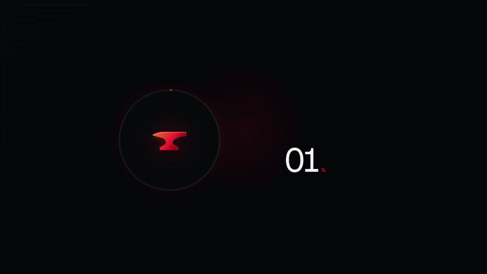

# Forge



Forge is the product, marketing, documentation, and future member-portal client for [cfn-forge](https://github.com/MJ66GA-Projects/cfn-forge), a CloudFormation deployment intelligence and lifecycle CLI.

The current site introduces the CLI through the same staged workflow the engine implements: resolve an environment, compare deployed and desired nested template trees, create an unexecuted Change Set, inspect the full impact, and release only after an explicit operator decision.

## Product status

- cfn-forge is currently version `0.1.0` and requires Python 3.12+
- the CLI is distributed from its public source repository, not through PyPI or a packaged binary
- Starter source access is available now
- Operator, Team, and Enterprise plans are product previews; checkout, gated downloads, Firebase membership, and role-based access are not live yet
- drift, reconcile, refactor analysis, and teardown planning are presented as preview capabilities
- the current engine targets AWS CloudFormation; multi-cloud deployment is not a current product claim

## Product surface

- `/product` explains Forge's position between existing CloudFormation definitions and AWS execution
- `/features` covers staging, nested template diffs, parameter impact, release gates, history, and preview tooling
- `/workflows` maps the infrastructure and pipeline stage-to-release lifecycle
- `/docs` documents source installation, project topology, and the current command grammar
- `/download` links to the public server source and provides the installation sequence
- `/plans` renders the reusable billing-cycle and pricing-plan component
- `/api` exposes the product discovery manifest
- `/api/features`, `/api/cli`, and `/api/plans` expose focused read-only manifests

The header uses a desktop mega menu and responsive mobile accordions generated from `src/shared/config/site.ts`. The root layout enables the header's `sticky` prop, which keeps the marquee and navigation together at the top of the viewport.

## Reusable components

- `src/app/components/product/code-block.tsx` renders repeatable, stateful snippet tabs with copy support and optional line numbers
- `src/app/components/product/pricing-table.tsx` renders reusable plans with monthly and annual state
- `src/app/components/product/product-page-hero.tsx` provides the shared product-page signal and metrics treatment
- `src/app/components/product/github-links.tsx` provides the Client and Server repository actions
- `src/app/components/brand/forge-icon.tsx` supplies the shared marquee, navigation, page, and product icons

Content that should remain truthful to the engine lives in `src/shared/config/product.ts`. Navigation, landing capabilities, process copy, and marquee items live in `src/shared/config/site.ts`.

## Stack

- Next.js 16 App Router
- React 19 and TypeScript
- Sass / SCSS
- GSAP-powered Forge loader
- next-pwa

## Local development

```bash
npm install
npm run dev
```

Open [http://localhost:3000](http://localhost:3000).

Clean public page routes are implemented below `src/app/(main)/pages` and registered in `next.config.ts` so they inherit the shared loader, sticky header, footer, fonts, blur layer, and theme.

## Repositories

- Client: [strawhat19/Forge](https://github.com/strawhat19/Forge)
- Server: [MJ66GA-Projects/cfn-forge](https://github.com/MJ66GA-Projects/cfn-forge)
